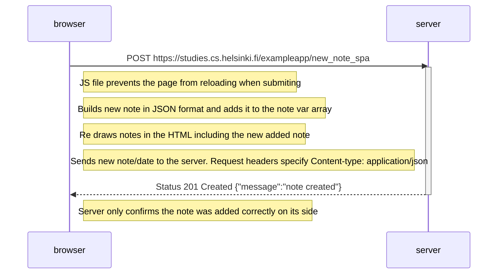

```mermaid
  sequenceDiagram
    participant browser
    participant server

    browser->>server: POST https://studies.cs.helsinki.fi/exampleapp/new_note_spa
    activate server

    Note right of browser: JS file prevents the page from reloading when submiting
    Note right of browser: Builds new note in JSON format and adds it to the note var array  
    Note right of browser: Re draws notes in the HTML including the new added note
    Note right of browser: Sends new note/date to the server. Request headers specify Content-type: application/json

    server-->>browser: Status 201 Created  {"message":"note created"}
    deactivate server

    Note right of browser: Server only confirms the note was added correctly on its side

```
